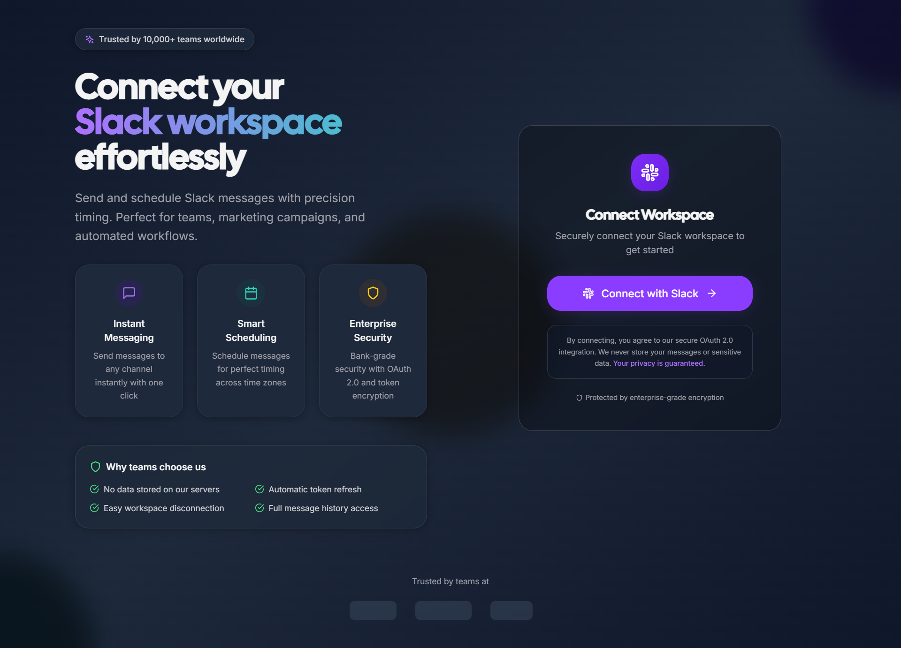

# Slack Connect

A comprehensive Slack integration application that enables users to connect their Slack workspace via OAuth 2.0, send messages immediately, schedule messages for future delivery, and manage scheduled messages with full CRUD capabilities.

   

## 🚀 Features

- **OAuth 2.0 Integration**: Secure workspace connection with automatic token refresh
- **Immediate Messaging**: Send messages instantly to any channel
- **Message Scheduling**: Schedule messages for precise future delivery
- **Message Management**: View, cancel, and track scheduled messages
- **Real-time Updates**: Automatic background processing of scheduled messages
- **Responsive UI**: Modern, user-friendly interface built with React and Tailwind CSS

## 📸 Preview

### Application Screenshots

<div align="center">

#### Homepage



_Clean and intuitive landing page with OAuth integration_

#### Dashboard


_Feature-rich dashboard for message composition and management_

## 📽️ Demo Video

> Watch SlackConnect Scheduler in action — instant & scheduled Slack messaging.

<p align="center">
  <a href="https://youtu.be/B4d1fZqNpOA" target="_blank">
    
  </a>
</p>

<p align="center">
  <a href="https://youtu.be/B4d1fZqNpOA" target="_blank" 
     style="text-decoration: none; display: inline-flex; align-items: center; 
            background-color: #FF0000; color: white; padding: 10px 18px; 
            border-radius: 6px; font-weight: bold; font-family: Arial, sans-serif;">
    
    Watch Demo on YouTube
  </a>
</p>

*🎬 Complete workflow demonstration from OAuth connection to message scheduling.*

## </div>

## 📋 Prerequisites

Before running this application, ensure you have:

- **Node.js**: Version 18.0 or higher
- **npm**: Version 8.0 or higher (comes with Node.js)
- **MongoDB**: Version 5.0 or higher (or Docker for containerized setup)
- **Slack App**: A Slack app with OAuth credentials

### Setting up a Slack App

1. Go to [Slack API Apps](https://api.slack.com/apps)
2. Click "Create New App" → "From scratch"
3. Name your app and select your workspace
4. Navigate to "OAuth & Permissions" in the sidebar
5. Add the following **Bot Token Scopes**:
   - `channels:read`
   - `chat:write`
   - `groups:read`
   - `im:read`
   - `mpim:read`
6. Set **Redirect URLs** to: `http://localhost:3001/auth/slack/callback`
7. Note your **Client ID** and **Client Secret** from "Basic Information"

## 🛠️ Installation & Setup

### 1. Clone the Repository

```bash
git clone <repository-url>
cd slack-connect
```

### 2. Install Dependencies

```bash
# Install root dependencies
npm install

# Install all dependencies (root, server, client)
npm run install:all
```

### 3. Environment Configuration

Create a `.env` file in the root directory:

```bash
cp .env.example .env
```

Edit `.env` with your Slack app credentials:

```env
# Slack OAuth Configuration
SLACK_CLIENT_ID=your_slack_client_id_here
SLACK_CLIENT_SECRET=your_slack_client_secret_here
SLACK_REDIRECT_URI=http://localhost:3001/auth/slack/callback

# Server Configuration
PORT=3001
NODE_ENV=development
JWT_SECRET=your_jwt_secret_here

# Database Configuration
MONGODB_URI=mongodb://localhost:27017/slack-connect

# Frontend URL
CLIENT_URL=http://localhost:5173
```

### 4. Start the Application

```bash
# Development mode (starts both frontend and backend)
npm run dev

# Or start individually
npm run server:dev  # Backend only
npm run client:dev  # Frontend only
```

The application will be available at:

- **Frontend**: http://localhost:5173
- **Backend**: http://localhost:3001

## 🏗️ Architecture

### High-Level Design

```
┌─────────────────┐    ┌──────────────────┐    ┌─────────────────┐
│   React Client  │    │  Express Server  │    │  Slack API      │
│   (Frontend)    │◄──►│   (Backend)      │◄──►│                 │
│                 │    │                  │    │                 │
│ - OAuth Flow    │    │ - Authentication │    │ - OAuth 2.0     │
│ - Message UI    │    │ - API Routes     │    │ - Message API   │
│ - Scheduling    │    │ - Scheduler      │    │ - Channel API   │
└─────────────────┘    └──────────────────┘    └─────────────────┘
                               │
                       ┌──────────────────┐
                       │   MongoDB        │
                       │                  │
                       │ - Users          │
                       │ - Scheduled Msgs │
                       └──────────────────┘
```

### Component Architecture

#### Backend (Node.js/Express)

```
server/src/
├── database/
│   └── database.ts          # MongoDB database layer
├── services/
│   ├── slackService.ts      # Slack API integration
│   └── schedulerService.ts  # Background job processing
├── routes/
│   ├── auth.ts             # OAuth endpoints
│   └── messages.ts         # Message CRUD endpoints
├── middleware/
│   └── auth.ts             # Authentication middleware
└── index.ts                # Express app entry point
```

#### Frontend (React/TypeScript)

```
client/src/
├── components/
│   ├── Navbar.tsx          # Navigation bar
│   ├── MessageComposer.tsx # Message creation form
│   └── ScheduledMessages.tsx # Message management
├── pages/
│   ├── LoginPage.tsx       # OAuth login flow
│   └── DashboardPage.tsx   # Main application dashboard
├── contexts/
│   └── AppContext.tsx      # Global state management
├── services/
│   └── api.ts              # Backend API client
└── types/
    └── index.ts            # TypeScript definitions
```

### OAuth 2.0 Flow

1. **User clicks "Connect Slack"** → Redirects to Slack authorization URL
2. **User authorizes app** → Slack redirects to callback with authorization code
3. **Backend exchanges code** → Obtains access_token and refresh_token
4. **Tokens stored securely** → MongoDB database with expiration tracking
5. **Frontend receives workspace info** → User authenticated and redirected to dashboard

### Token Refresh Logic

```typescript
// Automatic token refresh in scheduler service
if (user.token_expires_at <= currentTime) {
  const refreshResult = await slackService.refreshAccessToken(
    user.refresh_token
  );
  await database.updateUser(user.id, {
    access_token: refreshResult.access_token,
    token_expires_at: currentTime + refreshResult.expires_in,
  });
}
```

### Scheduling Mechanism

The background scheduler runs every minute using `node-cron`:

1. **Query pending messages** where `send_timestamp <= current_time`
2. **Refresh tokens if needed** before sending
3. **Send message via Slack API**
4. **Update status** to 'sent' or 'failed'
5. **Retry logic** with exponential backoff (max 3 retries)

## 📱 Usage

### Connecting Your Workspace

1. Open the application at http://localhost:5173
2. Click "Connect Slack Workspace"
3. Authorize the app in your Slack workspace
4. You'll be redirected back to the dashboard

### Sending Immediate Messages

1. Navigate to the "Compose Message" tab
2. Select a channel from the dropdown
3. Enter your message text
4. Click "Send Now"

### Scheduling Messages

1. In the "Compose Message" tab, check "Schedule for later"
2. Select your desired date and time
3. Enter your message text
4. Click "Schedule Message"

### Managing Scheduled Messages

1. Navigate to the "Scheduled Messages" tab
2. View all pending, sent, and failed messages
3. Cancel pending messages with the "Cancel" button
4. Monitor delivery status and retry counts

## 🧪 Testing

### Running Tests

```bash
# Run all tests
npm test

# Server tests only
npm run server:test

# Client tests only
npm run client:test
```

### Manual Testing Checklist

- [ ] OAuth flow completes successfully
- [ ] Channels load correctly after authentication
- [ ] Immediate messages send to correct channels
- [ ] Scheduled messages appear in management interface
- [ ] Messages send at correct scheduled time
- [ ] Cancel functionality removes scheduled messages
- [ ] Token refresh works automatically
- [ ] Error handling displays appropriate messages

## 🔧 API Endpoints

### Authentication Routes

| Method | Endpoint               | Description           |
| ------ | ---------------------- | --------------------- |
| GET    | `/auth/slack`          | Initiate OAuth flow   |
| GET    | `/auth/slack/callback` | Handle OAuth callback |
| GET    | `/auth/me`             | Get current user info |
| POST   | `/auth/refresh`        | Refresh access token  |

### Message Routes

| Method | Endpoint                  | Description              |
| ------ | ------------------------- | ------------------------ |
| GET    | `/messages/channels`      | Get available channels   |
| POST   | `/messages/send`          | Send immediate message   |
| POST   | `/messages/schedule`      | Schedule future message  |
| GET    | `/messages/scheduled`     | Get scheduled messages   |
| DELETE | `/messages/scheduled/:id` | Cancel scheduled message |

### Example API Usage

```typescript
// Send immediate message
await api.post("/messages/send", {
  channel: "C1234567890",
  message: "Hello, team!",
});

// Schedule message
await api.post("/messages/schedule", {
  channel: "C1234567890",
  message: "Reminder: Meeting in 10 minutes",
  sendTimestamp: 1703847600, // Unix timestamp
});
```

## 🚀 Production Deployment

### Environment Variables

For production, update these environment variables:

```env
NODE_ENV=production
SLACK_REDIRECT_URI=https://yourdomain.com/auth/slack/callback
CLIENT_URL=https://yourdomain.com
MONGODB_URI=mongodb://localhost:27017/slack-connect
JWT_SECRET=your_secure_jwt_secret_here
```

### Build Commands

```bash
# Build for production
npm run build

# Start production server
npm start
```

### Deployment Considerations

- **Database**: Consider using MongoDB Atlas for production
- **Security**: Use HTTPS, secure JWT secrets, rate limiting
- **Monitoring**: Add logging, error tracking, and health checks
- **Scaling**: Consider Redis for job queues, load balancers

## 🤝 Contributing

1. Fork the repository
2. Create a feature branch: `git checkout -b feature/amazing-feature`
3. Commit changes: `git commit -m 'Add amazing feature'`
4. Push to branch: `git push origin feature/amazing-feature`
5. Open a Pull Request

## 📄 License

This project is licensed under the MIT License - see the [LICENSE](LICENSE) file for details.

## 🆘 Troubleshooting

### Common Issues

**OAuth Callback URL Mismatch**

- Ensure your Slack app's redirect URL matches exactly: `http://localhost:3001/auth/slack/callback`

**Database Connection Errors**

- Check that the MongoDB connection URI is correct
- Verify MongoDB service is running

**Token Expiration Issues**

- Tokens refresh automatically; check server logs for refresh errors
- Verify your Slack app has proper OAuth scopes

**Scheduled Messages Not Sending**

- Check that the scheduler service is running (should see "Scheduler service started" in logs)
- Verify system time is accurate for scheduling

### Getting Help

1. Check the GitHub Issues for similar problems
2. Enable debug logging by setting `NODE_ENV=development`
3. Review server logs for error details
4. Verify Slack app configuration and permissions

---

**Designed and developed by Sahil Gautam — powered by TypeScript, React, Node.js, and the Slack API.**
